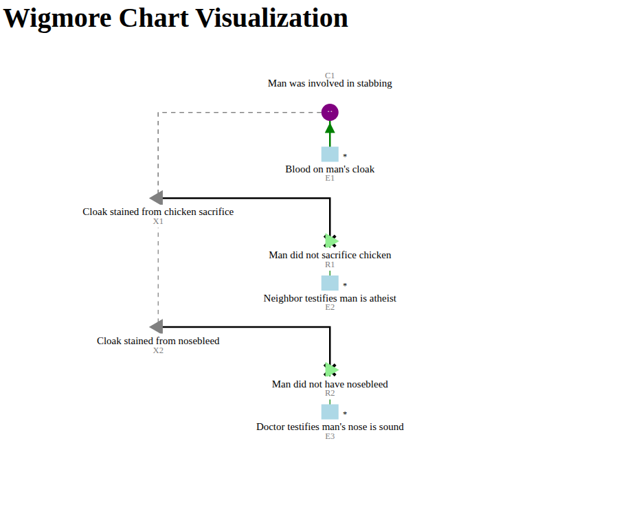

The above visualization renders from the input below

```tsx
import React from 'react';
import WigmoreChart from './WigmoreChart';
import { parseWigmoreText } from './utils/parseWigmoreText';

const App: React.FC = () => {
  const textInput = `
Nodes:
C1 | Man was involved in stabbing | conclusion | belief: ··
E1 | Blood on man's cloak | evidence | source: *
E2 | Neighbor testifies man is atheist | evidence | source: *
E3 | Doctor testifies man's nose is sound | evidence | source: *
X1 | Cloak stained from chicken sacrifice | explanation
X2 | Cloak stained from nosebleed | explanation
R1 | Man did not sacrifice chicken | refutation
R2 | Man did not have nosebleed | refutation
Edges:
E1 -> C1 | support | strength: strong
X1 -> C1 | explain | strength: weak
X2 -> C1 | explain | strength: weak
R1 -> X1 | refute | strength: strong
R2 -> X2 | refute | strength: strong
E2 -> R1 | support
E3 -> R2 | support
`;

  const wigmoreData = parseWigmoreText(textInput);

  return (
    <div>
      <h1>Wigmore Chart Visualization</h1>
      <WigmoreChart data={wigmoreData} width={1000} height={800} />
    </div>
  );
};

export default App;
```